# MLflow Model Alias Feature - One Pager

## 1. Overview

MLflow Model Alias is a Model Registry capability that assigns a readable, semantic name to a
specific Registered Model Version. It lets notebooks, jobs, and applications use a stable URI,
such as `models:/my-model@production`, instead of hard-coding a numeric model version.

An alias is a mutable pointer, not a copy of a model version. An authorized user can atomically
move an existing alias from one version to another without changing the URI used by consumers.

Fabric V1 uses MLflow 3.1 behavior as its compatibility baseline and adds workspace isolation,
a maximum of ten persisted aliases per registered model, ASCII case-insensitive identity, a
virtual `latest` alias, durable audit delivery, and staged rollout controls.

## 2. Core Capabilities

### 2.1 Alias Concept

| Item | Definition |
|------|------------|
| Purpose | A readable identifier that points to one Registered Model Version |
| Examples | `production`, `staging`, `champion`, `baseline` |
| Model URI | `models:/<model-name>@<alias>` |
| Mutability | Setting an existing alias atomically moves it to another version |
| Scope | Tenant, workspace, and registered model in Fabric V1 |
| Persisted limit | Up to ten user-managed aliases per registered model |

An alias must be non-empty, may contain alphanumeric characters, underscores, and hyphens,
and is limited to 255 characters. Fabric treats alias identity as ASCII case-insensitive and
returns canonical lowercase names, so `Champion` and `champion` identify the same alias.

Every case form of `latest` is reserved. The service resolves it dynamically to the highest
registered model version. It has no database row, is absent from standard `aliases` response
fields, and does not consume one of the ten persisted alias slots.

### 2.2 Data Model Lifecycle

The following diagram shows how alias data changes shape from SQL persistence through backend
data objects, MLflow contracts, serialized JSON, and frontend entities. It also shows the
reverse set/delete mutation path.

The alias fields shown below are the **Fabric V1 target design**. The current `workload-ml`
main branch does not yet fully implement the target `DbRegisteredModelAlias` or the standard
MLflow alias response fields.

```mermaid
flowchart LR
    subgraph DB["1. SQL persistence"]
        DB_MODEL["RegisteredModels<br/>PK: tenant_id + workspace_id + model_id<br/>model_name"]
        DB_VERSION["ModelVersions<br/>PK: tenant_id + workspace_id + model_version_id<br/>model_id + version_number"]
        DB_ALIAS["RegisteredModelAliases<br/>PK: tenant_id + workspace_id + model_id + alias_normalized<br/>FK: model_version_id<br/>alias_normalized: VARCHAR(255)"]
        DB_OUTBOX["AliasAuditOutbox<br/>event_id + operation<br/>alias + old/new version<br/>actor + committed_at + correlation_id"]

        DB_MODEL -->|"1 : many; model delete cascades"| DB_VERSION
        DB_MODEL -->|"1 : many; model delete cascades"| DB_ALIAS
        DB_VERSION -->|"1 : many aliases; version delete cleans mappings"| DB_ALIAS
    end

    subgraph DO["2. SQL data objects and service projection"]
        DO_MODEL["DbRegisteredModel<br/>Aliases: ICollection&lt;DbRegisteredModelAlias&gt;"]
        DO_VERSION["DbModelVersion<br/>ModelVersionId + Version<br/>RegisteredModel"]
        DO_ALIAS["DbRegisteredModelAlias target shape<br/>TenantId + WorkspaceId + ModelId<br/>AliasNormalized + ModelVersionId"]
        SERVICE["NativeRegisteredModelServiceManager<br/>authorize + canonicalize + join/project<br/>atomic set/reassign/delete<br/>backend flight: MLEnableAlias"]
    end

    subgraph DTO["3. MLflow contract DTOs"]
        DTO_REGISTERED["RegisteredModel<br/>Aliases: Dictionary&lt;string,string&gt;<br/>alias -&gt; version string"]
        DTO_VERSION["ModelVersion<br/>Aliases: IEnumerable&lt;string&gt;<br/>persisted aliases targeting this version"]
        DTO_GET_MODEL["GetRegisteredModelOutput<br/>registered_model: RegisteredModel"]
        DTO_GET_ALIAS["GetModelVersionByAliasOutput<br/>model_version: ModelVersion"]
        DTO_MUTATE["SetRegisteredModelAliasInput<br/>{ name, alias, version }<br/><br/>DeleteRegisteredModelAliasInput<br/>{ name, alias }"]
    end

    subgraph JSON["4. Serialized MLflow JSON"]
        JSON_MODEL["registered_model.aliases<br/>{ &quot;champion&quot;: &quot;5&quot;, &quot;baseline&quot;: &quot;3&quot; }"]
        JSON_VERSION["model_version.aliases<br/>[ &quot;champion&quot;, &quot;production&quot; ]"]
        JSON_MUTATE["POST /registered-models/alias<br/>DELETE /registered-models/alias"]
    end

    subgraph FE["5. trident-de-ds-app entities"]
        FE_MODEL["Registered Model FE entity<br/>aliases?: Record&lt;string,string&gt;<br/>model-level source of truth"]
        FE_VERSION["ModelVersionInterface<br/>aliases?: string[]<br/>version-row projection"]
        FE_UI["Properties card + right-side panel<br/>Version table + Notebook Alias column<br/>frontend flight: MLModelAliasUX"]
    end

    DB_MODEL -->|"EF / SQL materialization"| DO_MODEL
    DB_VERSION -->|"EF / SQL materialization"| DO_VERSION
    DB_ALIAS -->|"EF / SQL materialization"| DO_ALIAS

    DO_MODEL --> SERVICE
    DO_VERSION --> SERVICE
    DO_ALIAS --> SERVICE

    SERVICE -->|"group alias rows by model"| DTO_REGISTERED
    SERVICE -->|"reverse-project rows by model_version_id"| DTO_VERSION
    DTO_REGISTERED --> DTO_GET_MODEL
    DTO_VERSION --> DTO_GET_ALIAS

    DTO_GET_MODEL -->|"snake_case serialization"| JSON_MODEL
    DTO_GET_ALIAS -->|"snake_case serialization"| JSON_VERSION
    JSON_MODEL --> FE_MODEL
    JSON_VERSION --> FE_VERSION
    FE_MODEL --> FE_UI
    FE_VERSION --> FE_UI

    FE_UI -. "set/reassign/delete request" .-> JSON_MUTATE
    JSON_MUTATE --> DTO_MUTATE
    DTO_MUTATE --> SERVICE
    SERVICE -->|"same SQL transaction"| DB_ALIAS
    SERVICE -->|"durable audit intent"| DB_OUTBOX

    LATEST["Virtual latest<br/>computed as highest version<br/>NO DB row / NO DTO aliases entry"] -. "get/load resolution only" .-> SERVICE
```



#### Shape at Each Layer

| Layer | Primary shape | Alias representation |
|-------|---------------|----------------------|
| SQL | `RegisteredModelAliases` | One row per alias with canonical identity and target `model_version_id` |
| Data object | `DbRegisteredModelAlias` | Persistence object scoped by tenant, workspace, model, and version |
| Service projection | `NativeRegisteredModelServiceManager` | Groups rows by model or reverse-projects rows by version |
| Contract DTO | `RegisteredModel` / `ModelVersion` | Alias-to-version dictionary / alias-name list |
| JSON | `registered_model.aliases` / `model_version.aliases` | `Record<string, string>` / `string[]` |
| Frontend entity | Registered Model entity / `ModelVersionInterface` | Optional fields for compatibility with older services |
| UI | Properties, Version table, Notebook | Properties uses the full mapping; row projections use version-level aliases |

#### OSS MLflow 3.1 Compared with the Fabric Target

OSS MLflow 3.1 stores aliases with `(registered_model_name, alias)` as the SQL primary key and
stores the numeric `version` in the alias row. It validates the target version in application
logic and explicitly removes aliases that point to a deleted version.

The Fabric target uses stable model and version identifiers and includes tenant and workspace
identity in the persistence boundary. It must also guarantee that:

- an alias and its target version belong to the same tenant, workspace, and registered model;
- `(tenant, workspace, model, alias_normalized)` is unique;
- `ModelVersion.aliases` can be projected efficiently by `model_version_id`;
- concurrent requests cannot both create an additional "tenth" alias;
- the alias mutation and durable audit intent commit in the same SQL transaction.

### 2.3 Key Constraints

1. **Uniqueness:** One canonical alias points to one version within a registered model.
2. **Referential integrity:** The target version exists and belongs to the same tenant,
   workspace, and registered model.
3. **Cleanup:** Deleting a registered model removes its versions and aliases. Deleting a model
   version removes all persisted aliases that target that version.
4. **Atomic reassignment:** Readers may observe the old committed mapping or the new committed
   mapping during reassignment, but never a missing or uncommitted mapping. Reads after a
   successful write response return the new target.
5. **Case behavior:** ASCII case variants cannot coexist and consume one alias slot.
6. **Limit:** A registered model supports up to ten persisted aliases. Reassigning an existing
   alias does not consume another slot.
7. **Reserved names:** `latest` and `v<digits>` cannot be used as user-managed aliases.
8. **Workspace boundary:** Cross-workspace alias reads, mutations, and alias-URI loading are
   unsupported in V1 and use the existing resource-not-found behavior without disclosing
   whether a remote resource exists.

### 2.4 API Operations

Fabric reuses the MLflow alias API under `/api/2.0/mlflow`. V1 does not add a
`get_registered_model_aliases` SDK method or a custom `GET /registered-models/aliases` route.

#### 2.4.1 Set Registered Model Alias

```http
POST /api/2.0/mlflow/registered-models/alias
```

```json
{
  "name": "my-model",
  "alias": "champion",
  "version": "5"
}
```

Behavior:

- creates the mapping when the alias does not exist;
- atomically reassigns an existing alias;
- rejects an eleventh distinct alias without changing the existing ten mappings;
- rejects `latest`, its case variants, and reserved version forms such as `v123`;
- returns HTTP 200 on success; callers do not parse or depend on the success body.

```python
client.set_registered_model_alias(
    name="my-model",
    alias="champion",
    version="5",
)
```

#### 2.4.2 Delete Registered Model Alias

```http
DELETE /api/2.0/mlflow/registered-models/alias
```

```json
{
  "name": "my-model",
  "alias": "champion"
}
```

Behavior:

- deletes one exact logical alias identity; wildcard deletion is not supported;
- succeeds idempotently when the registered model exists but the alias is already absent;
- uses the existing error mapping when the registered model is missing or inaccessible;
- returns HTTP 200 on success; callers do not parse or depend on the success body.

```python
client.delete_registered_model_alias(
    name="my-model",
    alias="champion",
)
```

#### 2.4.3 Get Model Version by Alias

```http
GET /api/2.0/mlflow/registered-models/alias?name=my-model&alias=champion
```

```json
{
  "model_version": {
    "name": "my-model",
    "version": "5",
    "creation_timestamp": 123456789,
    "last_updated_timestamp": 123456789,
    "current_stage": "None",
    "source": "runs:/abc123/model",
    "run_id": "abc123",
    "status": "READY",
    "aliases": [
      "champion",
      "production"
    ],
    "tags": []
  }
}
```

Behavior:

- returns the complete `ModelVersion`;
- includes all persisted aliases that currently target that version;
- uses the existing resource-not-found response when the alias or model is missing;
- uses the same resolution semantics for `models:/my-model@champion`;
- dynamically resolves `latest` without appending it to `ModelVersion.aliases`.

```python
model_version = client.get_model_version_by_alias(
    name="my-model",
    alias="champion",
)

print(f"Champion version: {model_version.version}")
print(f"Persisted aliases: {model_version.aliases}")
```

### 2.5 Alias Fields on Standard Responses

Alias enumeration comes from existing MLflow entities rather than a separate list-alias API.

```json
{
  "registered_model": {
    "name": "my-model",
    "aliases": {
      "champion": "5",
      "baseline": "3"
    }
  }
}
```

```json
{
  "model_version": {
    "name": "my-model",
    "version": "5",
    "aliases": [
      "champion",
      "production"
    ]
  }
}
```

The Fabric V1 target contract is:

- Registered Model Create, Rename, Update, Get, and Search return
  `aliases: Record<string, string>`;
- Model Version Get Latest Versions, Create, Update, Transition Stage, Get, Search, and Get by
  Alias return `aliases: string[]`;
- fields remain optional for compatibility with services that have not deployed the additive
  contract;
- `latest` is never included in either standard alias field.

## 3. Error Handling

Fabric continues to use the existing workload MLflow error mapping and does not introduce an
alias-specific error envelope.

| Scenario | Result |
|----------|--------|
| Missing parameters, invalid name, more than 255 characters, eleventh alias, or reserved name | `400 Bad Request` |
| Caller lacks mutation permission | `403 Forbidden` |
| Model, target version, or a read alias is missing | Existing resource-not-found response |
| Bounded concurrency retries are exhausted | `409 Conflict` |
| Registered model exists but the deleted alias is already absent | `200`, idempotent success |
| Internal service failure | Existing `500` mapping |

The following payload is illustrative. Clients should depend on stable status and error codes,
not exact message text:

```json
{
  "error_code": "RESOURCE_DOES_NOT_EXIST",
  "message": "Registered model alias was not found."
}
```

## 4. Usage Scenarios

- **Stable deployment reference:** Deployment configuration uses `production` instead of a
  changing version number.
- **Champion/challenger:** `champion` identifies the preferred version and `challenger`
  identifies a candidate under validation.
- **Environment mapping:** `dev`, `staging`, and `production` communicate environment intent.
- **Fast rollback:** Atomically move `production` back to a retained version.
- **A/B experiment labels:** Use aliases such as `variant_a` and `variant_b`.
- **Dynamic newest version:** Use virtual `latest` when the highest version is desired, but not
  as a stable production pointer.

Aliases do not implement traffic splitting, approvals, or deployment orchestration. Those
capabilities belong to higher-level release systems.

### 4.1 UX Workflow

- OSS reference:
  [Register Model Alias](https://www.figma.com/design/T3sQllFUk6YpzPklB06yRC/Register-Model-Alias?m=auto&t=UTZJYHKCVY8l2OlQ-6)
- Fabric approved hi-fi:
  [Model alias management, node 1:358](https://www.figma.com/design/FVW015KwezJUi7ZrtJIpur/Model-alias-management?node-id=1-358)

The Fabric experience is entirely behind the `MLModelAliasUX` frontend flight:

1. The Alias row on the Properties card provides an edit action.
2. The edit action opens the right-side management panel.
3. The panel supports add, delete, and reassignment, with an inline warning when an existing
   alias is reused.
4. The Properties card displays aliases as tags.
5. Version tables and notebooks display aliases as plain comma-separated text, not badges.
6. When the flight is disabled, the new UX is absent and existing model/version workflows are
   unchanged.

### 4.2 Typical Python Workflow

```python
from mlflow import MlflowClient
import mlflow

client = MlflowClient()

# Train and register a model.
model_version = mlflow.register_model(
    "runs:/abc123/model",
    "my_model",
)

# Mark it as the current candidate.
client.set_registered_model_alias(
    "my_model",
    "candidate",
    model_version.version,
)

# Atomically promote it after validation.
client.set_registered_model_alias(
    "my_model",
    "production",
    model_version.version,
)

# Consumers use a stable semantic URI.
model = mlflow.pyfunc.load_model("models:/my_model@production")
```

## 5. Rollout

The backend and frontend use independent FMv2 flights:

- `MLEnableAlias` controls backend Model Alias capability rollout in `workload-ml`;
- `MLModelAliasUX` controls alias requests and UI in `trident-de-ds-app`.

Rollout enables and validates the backend first, then enables the frontend after the deployed
contract is confirmed. Rollback disables new backend writes first while preserving safe reads
and numeric-version loading, and disables the UX independently when required.

FeatureManagement owns flight registration, environment/ring targeting, and rollout
configuration. It is an external platform dependency, not a Feature 4643923 child code repo.

## 6. Future Directions

The following are not Fabric V1 commitments and require separate requirements and contract
review:

- assigning an initial alias directly in `create_model_version`;
- a true bulk alias mutation API with defined atomic batch semantics;
- customer-visible alias change history;
- alias search/filter after compatibility and query semantics are approved;
- cross-workspace alias references;
- integration with traffic splitting, approvals, and automated deployment policies.

## 7. Summary

MLflow Model Alias decouples a stable semantic model reference from its underlying numeric
version. Fabric V1 combines workspace-scoped persistence, atomic reassignment, standard MLflow
alias response fields, virtual `latest`, durable audit intent, and independent backend/frontend
rollout flights to provide a compatible, reversible, and observable foundation for model
version management.
